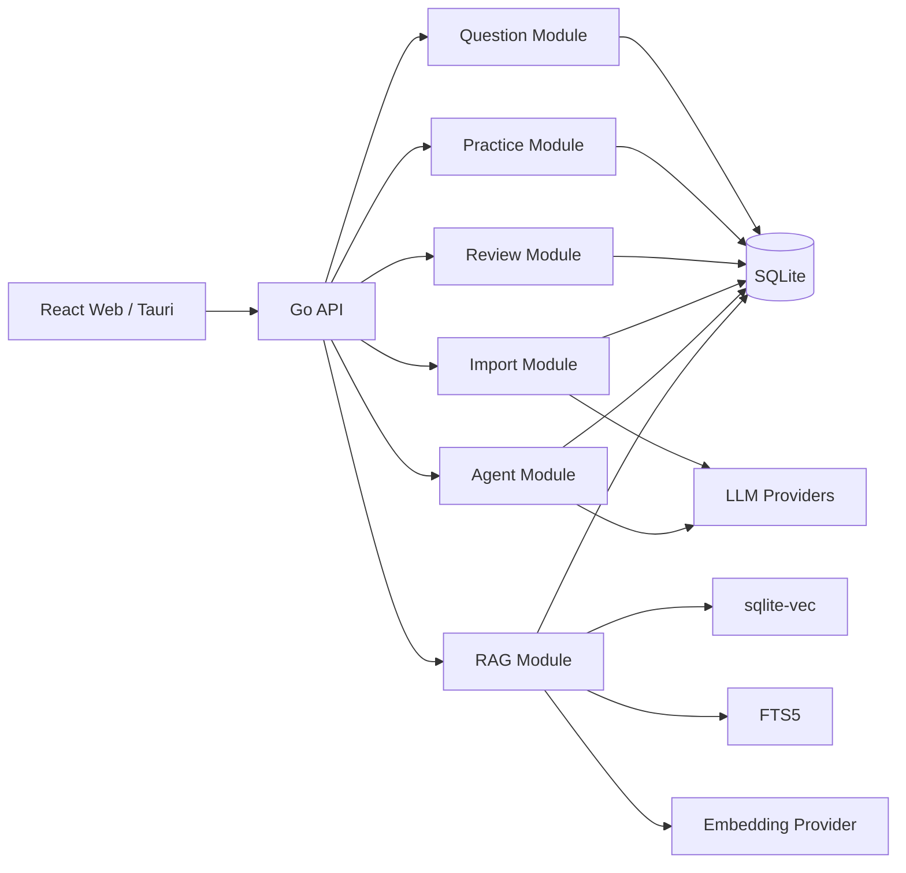
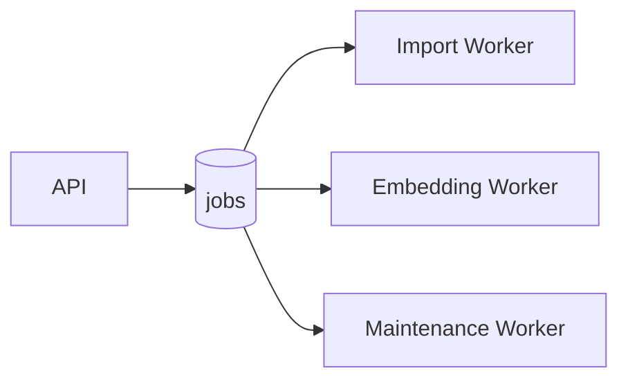

# 03. 系统架构设计

## 1. 总体架构

采用：

> Modular Monolith + Async Job Pipeline



---

## 2. 服务划分

Go 进程内部划分：

```text
Auth
User
QuestionBank
Question
Practice
WrongBook
Review
Document
Import
Pipeline
RAG
Agent
Provider
Statistics
Admin
```

这些模块是代码模块，不是独立服务。

---

## 3. 依赖方向

推荐：

```text
Handler
↓
Service / UseCase
↓
Domain
↓
Repository Interface
↓
SQLite Implementation
```

AI Provider 同样做接口隔离。

---

## 4. 数据层

### SQLite

保存：

- 用户；
- 题目；
- 导入任务；
- Agent 会话；
- 错题；
- Pipeline 状态。

### FTS5

负责：

- 关键词；
- BM25；
- 精确搜索。

### sqlite-vec

负责：

- Embedding；
- 语义检索。

### 文件系统

保存：

```text
data/
├── app.db
├── uploads/
├── originals/
├── processed/
├── temp/
└── exports/
```

---

## 5. 异步任务架构

采用 SQLite Job Queue。



MVP 不引入 Redis Queue。

---

## 6. SSE

统一用于：

- AI Token Streaming；
- Agent Tool Status；
- PDF 进度；
- Import Job 事件。

WebSocket 不作为第一选择。

---

## 7. 可插拔设计

需要抽象的接口：

```go
type LLMProvider interface {}
type EmbeddingProvider interface {}
type RerankProvider interface {}
type ReviewScheduler interface {}
type DocumentParser interface {}
type PipelineNode interface {}
type VectorStore interface {}
```

---

## 8. 未来可扩展

未来可以：

- SQLite → PostgreSQL；
- sqlite-vec → Qdrant；
- Local Job → Redis Queue；
- 本地文件 → S3；
- 单机 → 多实例。

但不能为了未来需求提前引入复杂依赖。
