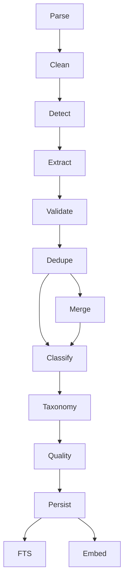

# 04. AI 题库构建引擎设计

## 1. 核心定位

题库导入不是普通上传功能。

它是：

> AI Question Bank Engine

负责将非结构化资料持续吸收到已有规范题库。

---

## 2. Source Question 与 Canonical Question

### Source Question

表示资料中的原始题。

来源包含：

- document_id；
- 页码；
- raw_text；
- 原始答案；
- 原始解析。

### Canonical Question

表示系统最终用于刷题的规范题。

多个来源可以映射同一个 Canonical Question：

```text
PDF A / Q18 ─┐
PDF B / Q41 ─┼── Canonical Question #1001
PDF C / Q9  ─┘
```

---

## 3. 增量行为

### 新题

创建 Canonical Question。

### 完全重复

只新增 Source Mapping。

### 题干相同但新解析更完整

合并来源，同时可补充 AI Enhanced Analysis。

### 答案冲突

建立 Conflict，不自动覆盖。

---

## 4. Pipeline DAG



---

## 5. Pipeline Node 标准

每个 Node 必须具备：

- Name；
- Version；
- Input Type；
- Output Type；
- Retry Policy；
- Idempotency Key；
- Metrics；
- Error Code。

接口：

```go
type PipelineNode interface {
    Name() string
    Version() string
    Execute(ctx context.Context, input NodeInput) (NodeOutput, error)
}
```

---

## 6. 幂等设计

每一步保存：

```text
input_hash
node_name
node_version
status
output_hash
```

如果相同输入 + 相同版本已经成功：

```text
SKIP
```

---

## 7. Pipeline Version

示例：

```text
pipeline_version = 2026.08.v1
document_parser = pdf-text-v2
extractor = question-extractor-v4
validator = question-validator-v3
classifier = classifier-v2
taxonomy = taxonomy-v1
```

---

## 8. 自动升级

未来 Prompt 或模型变化时可以执行：

```text
Reprocess:
confidence < 0.8
AND extractor_version < v5
```

而不需要重跑整个题库。

---

## 9. Error Taxonomy

统一错误类型：

```text
PDF_EXTRACT_FAILED
OCR_REQUIRED
BOUNDARY_UNCERTAIN
QUESTION_JSON_INVALID
ANSWER_MISMATCH
OPTION_MISSING
ANALYSIS_MISMATCH
DUPLICATE_UNCERTAIN
CLASSIFICATION_UNCERTAIN
TAXONOMY_CONFLICT
MODEL_TIMEOUT
MODEL_RATE_LIMIT
```

---

## 10. 质量状态

Canonical Question：

```text
draft
validated
published
needs_review
conflicted
archived
```

---

## 11. 题库自修复

定期 Quality Sweep：

- 无解析；
- 大量用户答错；
- 答案分布异常；
- 被用户举报；
- 多来源冲突；
- 无法分类；
- 旧 Pipeline 版本。

产生 Quality Alert，再触发重新审核。
