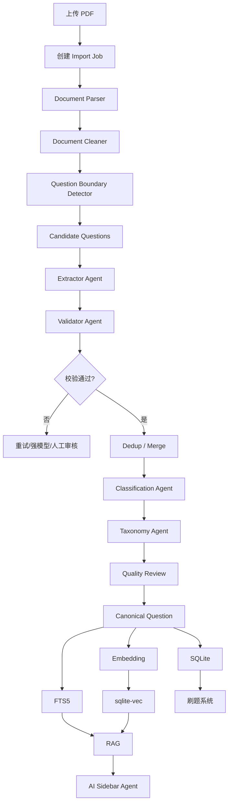

# AI 原生刷题 + RAG 题库系统开发文档包

## 1. 项目说明

本项目目标是开发一套参考“滑记”等刷题产品交互思路、但面向 AI 原生学习场景的完整刷题系统。

系统核心能力包括：

- 按题库 / 科目 / 章节刷题；
- 客观题即时判题并展示答案与解析；
- 错题自动进入错题本；
- 错题支持个人 Markdown 笔记；
- 错题基于可插拔复习算法自动调度；
- 支持大型 PDF 题库上传与增量扩充；
- 使用多 Agent 完成题目提取、校验、去重、分类、冲突检测和质量审核；
- 建立 Canonical Question（规范题）与 Source Question（来源题）关系；
- SQLite + FTS5 + sqlite-vec 构建轻量混合 RAG；
- 刷题页面集成 AI 侧栏 Agent；
- LLM / Embedding / Rerank 由用户自行配置；
- 支持 OpenAI Compatible 与 Anthropic Compatible 协议；
- 后端使用 Go；
- 前端使用 React + TypeScript + Vite；
- 数据库存储使用 SQLite；
- 第一阶段采用单体模块化架构；
- 后续可以通过 Tauri 2 封装 Windows / macOS / Linux 桌面应用。

---

## 2. 文档目录

```text
ai-question-rag-system-docs/
├── README.md
├── 01-background-and-product-positioning.md
├── 02-functional-requirements.md
├── 03-system-architecture.md
├── 04-ai-question-bank-engine.md
├── 05-pdf-ingestion-pipeline.md
├── 06-multi-agent-design.md
├── 07-rag-design.md
├── 08-review-and-wrong-book.md
├── 09-database-design.md
├── 10-api-design.md
├── 11-backend-design.md
├── 12-frontend-design.md
├── 13-development-standards.md
├── 14-security-and-model-provider.md
├── 15-deployment-and-operations.md
├── 16-testing-and-quality.md
├── 17-roadmap-and-todolist.md
└── appendix/
    ├── example-config.md
    ├── example-json-schema.md
    └── terminology.md
```

---

## 3. 推荐技术栈

### 前端

```text
React
TypeScript
Vite
Tailwind CSS
shadcn/ui
TanStack Query
Zustand
React Router
Markdown Renderer
SSE Client
```

### 后端

```text
Go
Gin
SQLite
FTS5
sqlite-vec
SSE
JWT
slog
```

### AI

```text
OpenAI Compatible
Anthropic Compatible
Embedding Provider
Optional Rerank Provider
```

### 桌面扩展

```text
Tauri 2
```

---

## 4. 核心架构原则

### 4.1 单体优先

第一阶段采用：

```text
Go Modular Monolith
+
SQLite
+
React
```

不引入：

```text
Redis
Kafka
RabbitMQ
Milvus
Elasticsearch
Kubernetes
微服务
```

### 4.2 大 PDF 不进入一次 LLM 请求

必须使用：

```text
上传
→ 分页解析
→ 清洗
→ 题目边界识别
→ Candidate Question
→ 多 Agent 结构化
→ 校验
→ 去重 / 合并
→ 分类
→ 入库
→ RAG 索引
```

### 4.3 AI 不直接替代确定性业务逻辑

以下操作必须由后端业务代码完成：

- 单选题判题；
- 多选题判题；
- 判断题判题；
- 数据库事务；
- 去重 Hash；
- 权限控制；
- 题库状态更新；
- 任务幂等；
- 向量和 FTS 索引生命周期。

AI 主要负责：

- 文档理解；
- 题目结构化；
- 分类；
- 低置信度验证；
- 冲突分析；
- 知识点抽取；
- AI 讲解；
- 主观题辅助评分。

---

## 5. 核心数据流



---

## 6. 开发优先级

第一阶段建议严格按照以下顺序：

1. 数据库 Schema；
2. 题库 / 科目 / 章节；
3. 刷题与判题；
4. 错题本与笔记；
5. Practice Session；
6. PDF 上传与 Job；
7. PDF 文本解析；
8. Candidate Question；
9. Question Extractor；
10. Validator；
11. 去重 / 合并；
12. 自动分类；
13. RAG；
14. AI Sidebar Agent；
15. 错题智能调度；
16. 统计；
17. Tauri 桌面封装。

详细开发任务见：

`17-roadmap-and-todolist.md`
